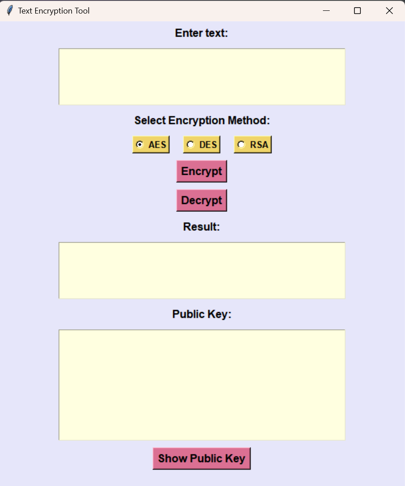
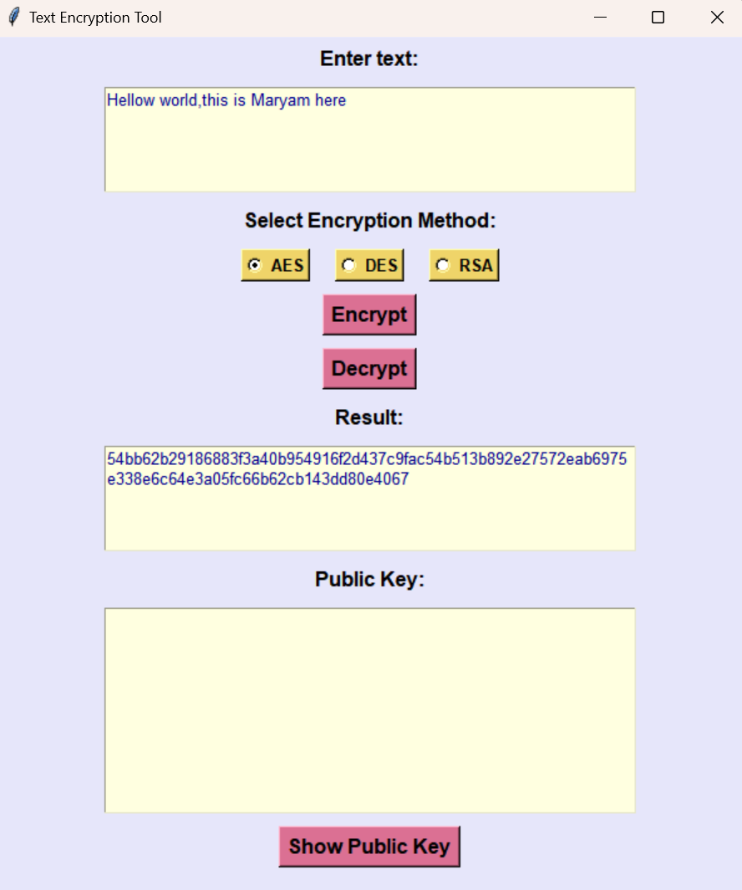
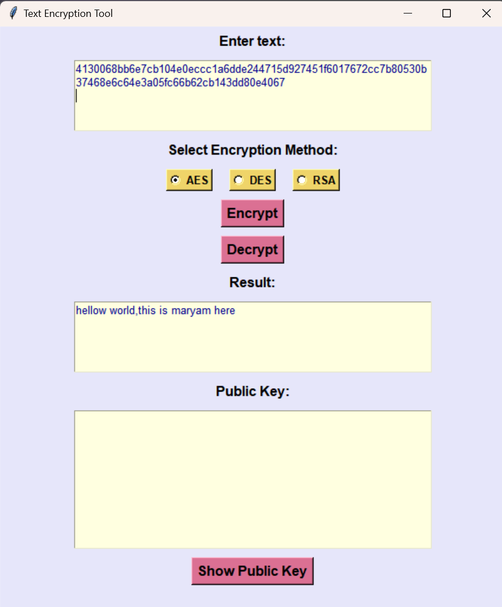
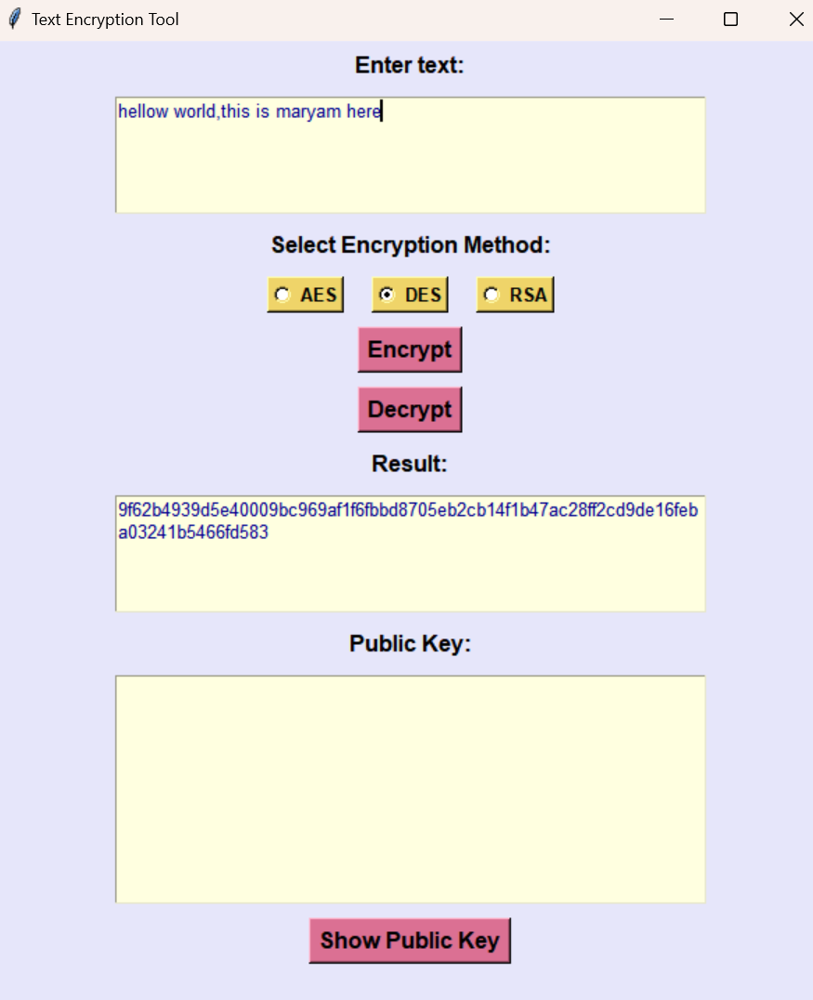
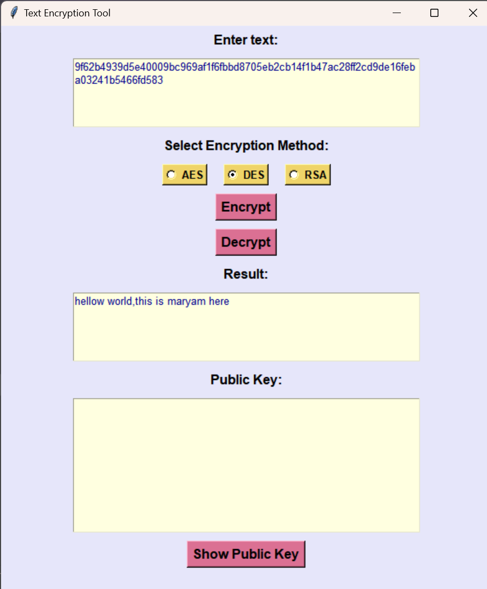
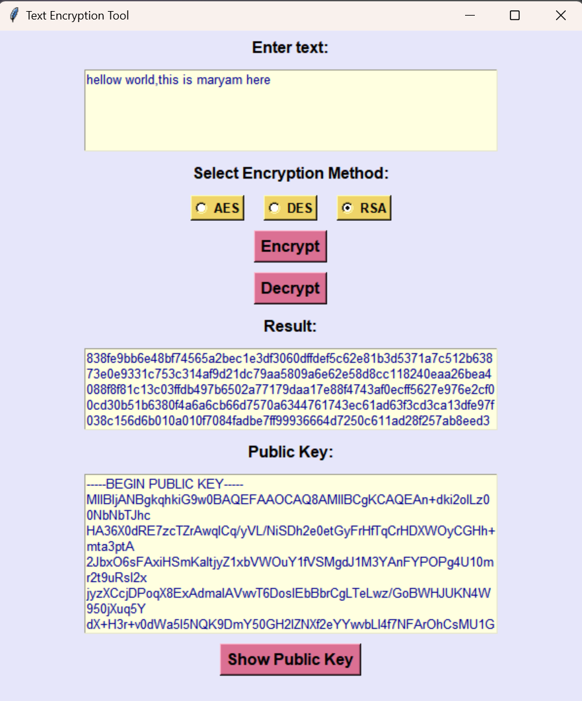

# Text Encryption Tool

A simple GUI application for text encryption and decryption using AES, DES, and RSA algorithms. Built with Tkinter and the Cryptography library in Python.

## Features

- **Encryption & Decryption**: Supports AES, DES, and RSA encryption algorithms.
- **RSA Key Display**: View and copy the RSA public key in PEM format.
- **Intuitive GUI**: Easy-to-use interface for quick text encryption and decryption.

## Screenshots


*GUI Window.*


 
*Encrypting text using AES encryption.*

 
*Decrypting text using AES decryption.*

 
*Encrypting text using DES encryption.*

 
*Decrypting text using DES decryption.*

 
*Encrypting text using RSA encryption.*

 
*Decrypting text using RSA decryption.*


## Installation

1. **Clone the Repository**:
    ```sh
    git clone https://github.com/MaryamFatima16/Text-Encryption-Tool.git
    cd Text-Encryption-Tool
    ```

2. **Install Required Packages**:
    Make sure you have Python 3.6 or above installed. Then, install the required Python packages:
    ```sh
    pip install cryptography
    ```

3. **Run the Application**:
    Execute the script:
    ```sh
    python encryption_tool.py
    ```

## Usage

1. **Enter Text**: Input the text you want to encrypt or decrypt in the "Enter text:" field.
2. **Select Encryption Method**: Choose the desired encryption method (AES, DES, or RSA).
3. **Encrypt/Decrypt**:
    - Click "Encrypt" to encrypt the text based on the selected method.
    - Click "Decrypt" to decrypt the text based on the selected method.
4. **View Result**: The encrypted or decrypted result will be shown in the "Result:" field.
5. **Show Public Key**: Click "Show Public Key" to display the RSA public key in PEM format.

## Encryption and Decryption Details

- **AES Encryption**: Uses a fixed 16-byte key. The text is padded to a multiple of 16 bytes.
- **DES Encryption**: Uses a fixed 8-byte key. The text is padded to a multiple of 8 bytes.
- **RSA Encryption**: Uses a 2048-bit RSA key. Encrypted text is displayed as a hexadecimal string.

- **AES Decryption**: Convert the encrypted text (hex) back to plaintext.
- **DES Decryption**: Convert the encrypted text (hex) back to plaintext.
- **RSA Decryption**: Convert the encrypted text (hex) back to plaintext.


## Notes

- **AES Key**: A fixed 16-byte key is used for AES operations.
- **DES Key**: A fixed 8-byte key is used for DES operations.
- **RSA Key**: A 2048-bit RSA key is generated for RSA operations.

## Contributing

Feel free to fork the repository, make improvements, and submit pull requests. For issues or feature requests, please open an issue in the repository.

## License

This project is licensed under the MIT License - see the [LICENSE](LICENSE) file for details.
